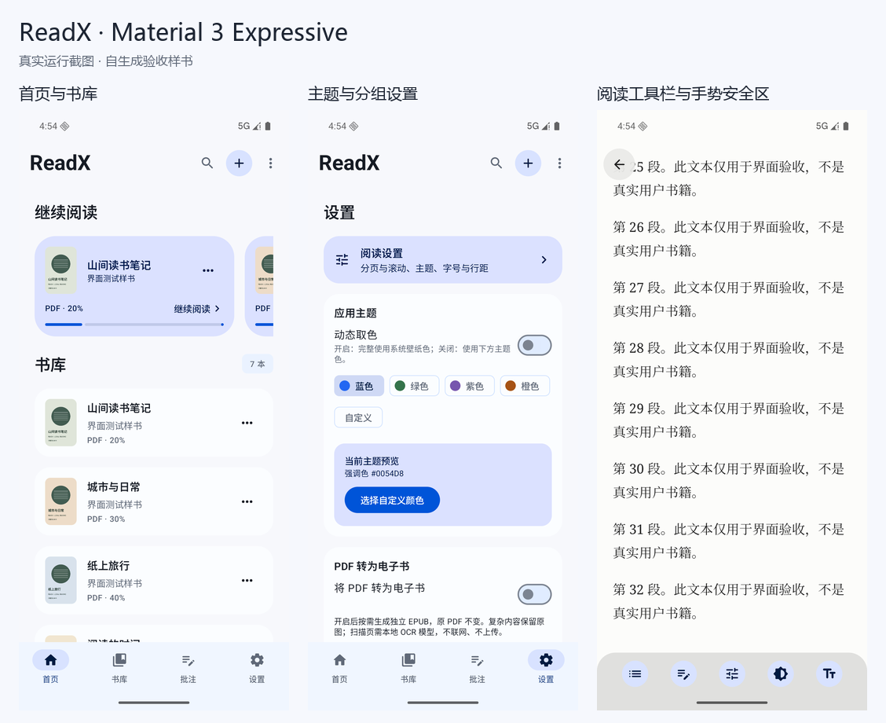

<p align="center">
  
</p>

<h1 align="center">ReadX</h1>

**一款离线的 Android 本地阅读器。** 支持 EPUB、TXT、PDF；原生 Kotlin + Jetpack Compose + Material 3 Expressive，无账号、无广告；阅读与转换离线，模型在线下载需主动开启。

> [!IMPORTANT]
> 本项目为一个 AI 开发的项目，代码、架构及文档主要由 `gpt-6.1-sol Codex` 生成。欢迎提出改进建议或参与测试。

[下载预览版](https://github.com/wjhhm2003/ReadX/releases)   [第三方声明](docs/THIRD_PARTY.md)  [MIT 许可证](LICENSE)

Material 3 Expressive 与 AndroidX PDF 使用实验/预发布 API。



## 功能

| 功能 | 当前实现 |
| --- | --- |
| 本地书库 | SAF 多文件导入、私有副本、SHA-256 内容去重；真实 EPUB 封面/PDF 首页缩略图；修改书名/作者/标签 |
| TXT / EPUB | TXT 默认原生 StaticLayout，可按书切换 WebView；EPUB 保留 WebView。按实测阅读区域分页或滚动；滑动和三分屏点击；目录、本地链接、中文搜索、字号/字体/行高/页边距与纸张主题 |
| 全书页数 | 当前章先显示，渐进测量全书；多维布局缓存；统计完成前显示真实已测章节数，不用估算值冒充精确总数 |
| 文字批注 | 高亮、划线、笔记、颜色、删除与重开恢复；DOM UTF-16 偏移＋原文/上下文校验，不宣称通用 EPUB CFI |
| PDF 原版 | AndroidX 高级纵向查看器＋系统 PdfRenderer 回退；横向单页、缩放、真实文字选取、页跳转、反色夜间模式与批注；功能按实际系统能力启用 |
| PDF → EPUB | 可关闭、默认关闭；文字层提取＋离线 OCR；后台真实页数进度、取消/续算；生成独立 EPUB，不修改原 PDF；原页回看与 SAF 导出 |
| 界面 | Material 3 Expressive、浅色/深色、动态/自定义主题色、沉浸正文、统一系统手势区；宽屏侧栏与内容限宽 |

启动进入合并后的书库，不自动打开上次的书。TXT/EPUB 左右区域上一页/下一页，中间显隐工具栏；PDF 纵向任意位置单击显隐，横向左/中/右三等份翻页或显隐。选区、链接和已有标记仍有相应交互。

## 0.7.3 PDF 交互与 OCR 性能

- PDF 横向、裁边及支持文字层的基础路径：长按选中文字，可拖动首尾手柄扩选；只绘制引擎返回的真实文字范围，不再按估算行高画框或在失败时创建区域标记。扫描页无文字层、旧系统基础引擎无选字能力时明确提示，原有区域批注仍保留并可编辑。
- PDF 纵向应用侧列表的页码滑条松手后移动实际列表，向前/向后跳转共用同一个列表状态；高级纵向仍由 AndroidX 原生视口跳转。
- 阅读下栏增加 **PDF 夜间反色**，也可在颜色面板中切换；独立保存开关，覆盖高级纵向、横向、裁边及基础回退。反转页面 RGB，不改变透明度、原文件、缓存位图或批注原页坐标；应用批注单独绘制，彩色图片也会反色，不是语义重排或仅文字变色。
- 离线 OCR 改为有界页级 CPU 并行：按设备核数、应用内存级别与可用内存选择独立识别器，按页复用，不同时共享单个 Tesseract 实例。PDF 提取/渲染仍串行，识别并行；按原页顺序保存检查点，支持原有取消、续算和模型更换。低内存降为单任务，不承诺固定提速倍数或持续占满所有 CPU。

## 0.7.0 本地工具与体验打磨

- **书库作为主页**：合并原首页，顶部保留可折叠的最近在读；导航为书库 / 批注 / 设置，不生成没有采集依据的时长和进度曲线。
- 列表/网格视图、最近阅读/阅读进度/导入时间/书名/真实源文件大小排序；长按书籍编辑信息和标签，可从 SAF 更换本地封面，不改源书文件。
- 阅读下栏常驻真实页码滑条，章节微调（PDF 为原文页微调）；点击或长按页码输入精确数字。页数仍未知时明确显示统计中，不能输入伪造总页码。
- 选区工具栏改为贴近选段的轻量气泡，颜色按需展开；同章跨页支持词/句吸附。吸附是 Unicode 分段启发式，不是 AI 理解或完整中文分词；不支持跨章节。
- 批注列表定位后短淡入和临时闪烁，不写回新的标记。按书可导出全部历史批注为 Markdown / TXT，或复制整书批注；保留重复笔记，不只导出可见页。复制内容过大时明确要求文件导出，不静默截断。
- PDF 裁边改为完整原页预览上的四边/四角手柄，原页边缘及保守检测边缘可磁吸。范围规则仍为当前页 > 奇偶页 > 全书 > 自动，取消不保存草稿。
- 本地 TTF / OTF 导入，复制到私有目录、按内容哈希保存，最多16 MiB/文件及12个字体；TXT 原生和 WebView/EPUB 共用选择，不改变 PDF 原文字体。字体文件不随导出书籍打包，用户字体许可证由用户自行保留。
- 转换失败显示原文页/处理阶段及原因类别，继续/重试失败页复用仍有效的页检查点；切换模型后受影响的识别页需要重新计算。

### 可关闭的在线 OCR 模型下载

设置 → PDF 转为电子书 → **允许在线模型下载**，默认关闭；开启后仍需主动点击下载所选语言。关闭取消未完成下载，已导入模型保持可用。没有模型时仍可从本地导入；下载失败不影响已有模型或原 PDF 阅读。

仅下载官方 `tesseract-ocr/tessdata_fast` 固定提交 `65727574dfcd264acbb0c3e07860e4e9e9b22185` 的 chi_sim、chi_tra、eng，校验固定字节数与 SHA-256，拒绝跳转至其他地址。连接方可看到 IP 和常规请求信息，**不发送整书、引用或笔记**。转换始终本机执行。关闭开关是应用下载策略控制，不会撤销 Android 普通网络权限。

## 0.6.1 PDF 分页居中

PDF 单页分页/左右翻页改为水平、垂直居中，裁边及非裁边使用相同规则；缩放、选区、搜索命中及标记随页面偏移。连续纵向滚动列表保持自然排列。此补丁按用户要求只编译成品，不运行本轮测试。

## 0.6.0 阅读引擎与裁边

- TXT 的阅读内「排版」面板可选 **原生 / WebView**，按书保存；没有设置的旧/新 TXT 默认原生，EPUB 不出现该开关。字号、字体、行高、页边距、主题、目录、搜索和分页/滚动继续共用设置。
- 原生排版按文字窗口测量，不一次排整章；先准备当前文字位置和相邻页，再由单个可取消任务统计全书。总数未知时显示统计状态；中部冷恢复未有完整边界时不冒充精确全书页码。两引擎允许页码不同，用原文/上下文锚点切换。
- 原生文字偏移来自现有 TXT HTML 的正文文本节点索引，**不是数据库 `chapters.text` 的直接偏移**。重复原文不能唯一校验时保留旧记录并提示；此定位不是 EPUB CFI。选段支持同章跨页，本轮不支持跨章节。
- PDF 的下栏「裁边」默认关闭；可自动检测或在完整原页预览中拖动四边，范围为当前页/全书/奇数/偶数。优先级为当前页 > 奇偶规则 > 全书 > 自动。取消不保存手动草稿，清除规则/关闭裁边可撤销。源 PDF 与真实页数不变。
- 裁边路径是应用侧横向分页/纵向虚拟列表，不改 AndroidX 内部布局。支持高级 `PdfDocument` 的系统保留文字层搜索、文字选择与链接；基础系统提供区域选择，不承诺文字搜索。边缘复杂/暗色/空白页不可靠时保留整页；手动裁边仍可能由用户主动裁掉页码、脚注或边注。
- 标记颜色和笔记更新不重新分页；PDF 矩形永远存原页归一化坐标。裁边位图缓存限制 **32 MiB**，只按视口加载；这不是应用总内存上限。
- Room 5→6 是增量迁移，保留历史章节、相对位置、书签、重复笔记与转换关联。没有 destructive migration；普通版继续不内置 OCR 模型、没有网络权限。

模拟器同环境冷缓存/缓存重开各10次已对照记录；不是逐次进程冷启动，性能目标仍需天玑700实机验收。最终对照及未覆盖项目见 [验证记录](docs/TESTING.md)，不将模拟器成绩或仅构建成功称作全项验收。

## 两种 APK：包名相同

| 预览包 | OCR 模型 | 适用情况 |
| --- | --- | --- |
| 普通版 `readx-0.7.0-preview.apk` | 不内置；从本地导入 | 安装包较小，自行选择模型 |
| 内置版 `readx-0.7.0-ocr-preview.apk` | 简中 `chi_sim`、繁中 `chi_tra`、英文 `eng` | 安装后离线可用，手动准备模型 |

**两版 applicationId 都是 `io.readx.app`，不能并存，安装会更新替换同一应用。** 本仓库的个人 Preview 使用本机调试密钥，不是正式发行签名；自己构建可能使用不同密钥，不能保证覆盖安装他人的 APK。请先导出需要保留的原书和转换版，**不要通过卸载/清空应用解决签名冲突**。

普通版在设置中通过系统文件选择器导入 `.traineddata`，单文件最多 64 MiB；内置版首次在后台校验并部署模型，已有可用用户模型不会被覆盖。语言可选“简中＋英文 / 繁中＋英文 / 英文”。三个模型不能保证所有文档都准确识别。

## 使用 PDF 转换

1. 在 **设置 → 将 PDF 转为电子书** 开启开关；不会批量转换整个书库。
2. 选择识别语言；普通版扫描件需要先导入相应模型，有正常文字层不要求 OCR 模型。
3. 点开 PDF，观察实际原文页数进度。缺模型时任务等待，导入后点击“继续 / 重试”；可先读原 PDF。
4. 完成后打开独立转换版，使用现有 EPUB 排版/搜索/批注；进度面板可 **查看原 PDF / 导出 EPUB**。

复杂或不可靠内容保留原图，未获得可重排正文则明确失败。原 PDF 与转换版的进度、页码和批注独立；PDF 页坐标标记不自动变成文字标记。密码 PDF 首版不转换；原版查看器仍按系统支持处理。后台任务可能受系统配额、电量和进程限制中断。

## 隐私与数据

- 0.7.0 经用户确认增加 `INTERNET` / `ACCESS_NETWORK_STATE`，只用于主动开启的一键模型下载。默认关闭且可关闭；没有远程 OCR/LLM，不上传书籍、选段或笔记，没有账号或广告。
- 导入后读取应用私有副本，不修改原文件；移除书库条目不删除原始文件。
- 书籍、数据库、笔记和模型在私有目录；当前不额外加密，也不把应用当作加密保险库。
- 系统自动备份关闭，尚未完成数据库/文件一致性备份恢复。**卸载会删除应用副本和私有批注**，原始文件不受影响。
- 通知只报告阶段和页数；通知权限可拒绝，应用内仍可观察状态。生成 EPUB 可导出为独立文件。
- 仓库不收录用户书籍、笔记、签名密钥、模型二进制或测试日志。第三方模型及组件保留各自许可证。

## 构建

### 环境

Android Studio / JDK 17+（Java 源码目标 17），Android SDK 36.1；最低 Android 9 / API 28，target API 36。使用项目 Gradle Wrapper，不依赖全局 Gradle。

固定组合：Gradle 9.3.1（含分发包 SHA-256）/ AGP 9.1.0 / AGP 内置 Kotlin 2.2.10 / Compose compiler 2.2.10 / KSP 2.3.12 / Compose BOM 2026.01.00 / Material 3 1.5.0-alpha01 / Room 2.8.5 / AndroidX PDF 1.0.0-beta01。实际值以构建配置为准，不需要为了编译自行升级依赖。

在 Android Studio 打开仓库，或设置 `JAVA_HOME` / Android SDK。`local.properties` 仅是本机配置，不提交；Windows 路径示例：`sdk.dir=E\:/Android/Sdk`。仓库脚本在本机环境脚本存在时加载，否则使用调用者环境。

### 普通版

```powershell
.\gradlew.bat assembleDebug testDebugUnitTest lintDebug assemblePreview
```

macOS/Linux 使用 `./gradlew`。依赖已下载时可添加 `--offline`，首次解析依赖需要开发电脑联网。普通版不需要下载 OCR 模型才能编译。

输出：`app/build/outputs/apk/debug/app-debug.apk`、`app/build/outputs/apk/preview/app-preview.apk`。正式 Release 不内置签名凭据。

### 内置三个模型的版本

先显式准备固定版本模型，再构建。准备脚本访问的是开发电脑，不赋予 Android 应用联网权限。

```powershell
.\scripts\prepare-ocr-models.ps1
.\gradlew.bat assemblePreview -PbundledOcr=true
```

或跨平台：

```sh
python3 scripts/prepare-ocr-models.py
./gradlew assemblePreview -PbundledOcr=true
```

已有模型可完全离线准备：PowerShell 加 `-LocalModelDirectory /path/to/models`，Python 加 `--local-directory /path/to/models`。脚本和 Gradle 会核对文件大小及 SHA-256；没有模型或校验不符时不生成假内置包。

模型来自官方 [tessdata_fast 4.1.0](https://github.com/tesseract-ocr/tessdata_fast/tree/4.1.0)，固定提交/哈希见 [模型清单](app/src/ocrBundled/assets/ocr/manifest.json)，原许可证一同打包。源码仓库只保存清单和许可证，`.traineddata` 被 Git 忽略。内置版仍输出同一构建路径，请将产物复制另存，避免与下一次普通构建混淆。

### 设备验证

```powershell
adb devices
.\gradlew.bat connectedDebugAndroidTest '-Pandroid.injected.androidTest.leaveApksInstalledAfterRun=true'
# 内置版定向验证（先准备模型）
.\gradlew.bat connectedDebugAndroidTest -PbundledOcr=true '-Pandroid.testInstrumentationRunnerArguments.class=io.readx.app.BundledOcrInstrumentedTest' '-Pandroid.injected.androidTest.leaveApksInstalledAfterRun=true'
```

仅在专用模拟器/测试设备执行；Gradle 会安装更新 APK，保留 APK 参数不等于书库备份。R8 构建和设备 UI 测试分阶段运行，不同时争用资源。

## 已知边界

- EPUB 是基础本地 WebView 适配器，不是完整 Readium 引擎；不支持 DRM、固定版式、字体混淆、音视频及复杂脚注全兼容。
- 普通阅读进度仍保留章节/相对位置兼容，文字锚点优先用于会话内重排及批注；书架文本百分比是章节等权估算。全书页数只对当前排版有效。
- OCR 会有错字、漏字；竖排、手写、复杂双栏、扫描图表/公式和脚注顺序没有完整验收，启发式复杂区域检测不能代替语义理解。应与原 PDF 对照。
- 原版扫描 PDF 默认不承诺全文可搜；OCR 转换版只能搜索已识别正文，原图回退页不是可搜索文字。
- 完整一致性备份、多语言本地化和原 PDF 批注写回未实现；大字体、旧系统、低端设备、折叠屏和长期压力仍需扩展验证。
- 256 MB 源文件 / TXT 32 MB；EPUB 解压合计 160 MB、单资源 24 MB、单章 8 MB、最多 10000 资源。异常或超限明确失败，不清空书库规避。

## 项目结构与贡献

- `data/`：Room v6、显式历史迁移、导入去重与私有副本。
- `reader/`：TXT/EPUB、受控 HTML/选区脚本、分页与布局缓存。
- `pdf/`：高级查看器、基础回退、PDF 生命周期与批注。
- `conversion/`：PDF→EPUB、任务状态、检查点和本地 OCR。
- `ui/`：Compose 界面、主题、设置及 ViewModel。

详见 [架构](docs/ARCHITECTURE.md)、[设计](docs/DESIGN.md)、[To Do](docs/ROADMAP.md)、[贡献指南](CONTRIBUTING.md)。历史验证是指定设备/版本的记录，不代表所有场景或本次发布全部重新测试。

## 许可证与致谢

ReadX 原创代码采用 **[MIT License](LICENSE)**，版权所有 © 2026 wjhhm2003 及贡献者。第三方代码、适配片段、字体资源与模型**不因项目采用 MIT 而改为 MIT**，仍遵循各自条款。

完整归属和版本见 [NOTICE](NOTICE) 与 [第三方清单](docs/THIRD_PARTY.md)；原文许可证保存在 [应用资产](app/src/main/assets/licenses)，设置页也可查看。感谢 AndroidX、Jetpack Compose、Material Components、Kotlin、jsoup、PdfBox-Android、Tesseract4Android、pdf-craft 和 epub-generator 等项目。
